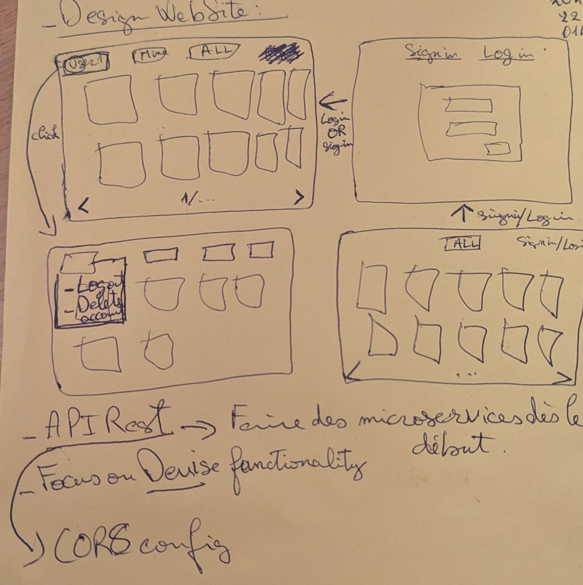
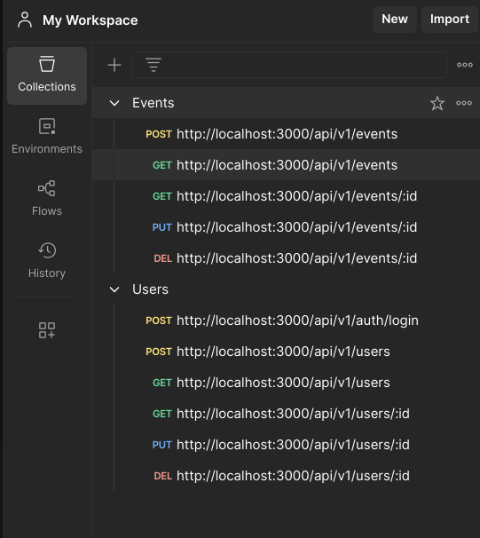

# Mini-Application de Gestion d'Événements


---

## À propos du projet
Cette mini-application Ruby on Rails permet de gérer des événements.

---

## Fonctionnalités

L'ensemble de ces focntionnalités est réalisé **UNIQUEMENT EN API**

| Fonctionnalité                                                            | Statut     |
|---------------------------------------------------------------------------|------------|
| Initialisation de l'application Rails avec PostgreSQL                     | ✅ Fait     |
| Modèle User avec email et password_digest via Devise                      | ✅ Fait     |
| Modèle Event avec title, description, date, location et user_id            | ✅ Fait     |
| Validations sur les champs (titre obligatoire, date future, description min 10 caractères) | ✅ Fait     |
| CRUD complet pour les événements                                          | ✅ Fait     |
| Accès restreint (un utilisateur ne peut modifier que ses propres événements) | ✅ Fait     |
| Authentification utilisateur avec Devise                                  | ✅ Fait     |
| Accès sécurisé : seuls les utilisateurs authentifiés peuvent gérer leurs événements | ✅ Fait     |
| Visibilité des événements : lecture publique pour tous                    | ✅ Fait     |
| Pagination (Affichage des événements par lot de 10)                       | ✅ Fait     |
| API REST : Endpoints GET, POST, PUT, DELETE pour les événements            | ✅ Fait    |
| Authentification par token (JWT) pour l'API                               | ✅ Fait    |
| Indexation des clés étrangères                                            | ✅ Fait    |
| Optimisation des N+1 queries avec Bullet                                  | ❌ Pas fait |
| Respect des bonnes pratiques de Rails MVC                                 | ✅ Fait     |

---

## Pile Technologique
- **Framework** : Ruby on Rails
- **Base de données** : PostgreSQL
- **Authentification** : Devise et JWT (via `jwt` gem)
- **Front-end** : ERB avec Tailwind CSS pour le style
- **API** : RESTful
- **Outils d'optimisation** : Bullet pour la détection des N+1 queries
- **Pagination** : Utilisation de `kaminari`

---

## Architecture
L'application suit l'architecture MVC classique de Ruby on Rails :
- **Modèles** : User, Event
- **Vues** : ERB pour l'interface utilisateur
- **Contrôleurs** : Gestion des actions CRUD et des endpoints API

---

## Schéma de Base de Données
Vu que la BDD est relationnelle et ne contient que deux tables, il est inutile d'en produire un schéma.
---

## Approche de Développement
Dès la première lecture du test, j'ai analysé les différentes fonctionnalités à implémenter et j'ai établi un ordre de priorité pour le développement. Par exemple, j'ai d'abord donné la priorité à l'authentification utilisateur avec Devise, car elle conditionnait l'accès aux autres fonctionnalités comme la création et la modification des événements.

Pour mieux organiser les vues, j'ai réalisé un croquis rapide des pages principales, notamment :
- La page d'authentification et d'inscription, avec des champs pour l'email et le mot de passe.
- La page listant les événements avec une pagination par lot de 10, chaque événement étant affiché sous forme de carte avec son titre, sa date et son lieu.
- La popup de détails d'un événement, permettant de le modifier ou le supprimer si l'utilisateur en est le propriétaire.
  
Ce croquis m'a permis de visualiser les différents composants et de mieux anticiper leur intégration lors du développement.

Après avoir lu l'énoncé, j'ai décidé de partir sur une architecture avec une API REST afin de séparer le back-end et le front-end, ce qui offre une meilleure scalabilité et facilite d'éventuelles évolutions. J'ai donc commencé par développer cette API en utilisant les conventions REST de Rails, notamment mais pas que (beaucoup plus détaillé dans la section API) :
- `GET /api/v1/events` pour récupérer la liste des événements de manière paginée.
- `POST /api/v1/events` pour permettre aux utilisateurs authentifiés de créer un événement.
- `PUT /api/v1/events/:id` pour mettre à jour un événement, avec une vérification de l'utilisateur propriétaire.
- `DELETE /api/v1/events/:id` pour supprimer un événement, également sécurisé par la vérification du propriétaire.

L'intégration des différentes contraintes techniques (comme les validations sur les champs) et fonctionnelles (comme la visibilité des événements pour tous les utilisateurs en lecture seule) s'est avérée relativement simple grâce aux fonctionnalités natives de Rails. 

Enfin, voici le croquis initial qui m'a aidé à structurer l'application :

---

## Installation et Configuration

### Prérequis
Assurez-vous d'avoir les éléments suivants installés sur votre machine :
- **Ruby** version 3.x
- **Rails** version 7.x
- **PostgreSQL** version 14.x
- **Node.js** et **Yarn** pour la gestion des assets

### Étapes d'installation

1. **Clonez le dépôt**
2. **Installez les dépendances**
   ```bash
   bundle install
   yarn install
   ```

3. **Initialisez la base de données**
   ```bash
   rails db:create
   rails db:migrate
   rails db:seed
   ```

4. **Lancez le serveur**
   ```bash
   rails s
   ```

5. **Accédez à l'application**
   Ouvrez votre navigateur et rendez-vous sur : `http://localhost:3000`

### Notes
- Assurez-vous que PostgreSQL est en cours d'exécution avant de démarrer l'application.

---


## Documentation de l'API : Endpoints de l'API

### Events
- **POST** `/api/v1/events` : Créer un nouvel événement.
- **GET** `/api/v1/events` : Récupérer la liste des événements (paginée).
- **GET** `/api/v1/events/:id` : Récupérer les détails d'un événement spécifique.
- **PUT** `/api/v1/events/:id` : Mettre à jour un événement (authentifié et propriétaire).
- **DELETE** `/api/v1/events/:id` : Supprimer un événement (authentifié et propriétaire).

### Users
- **POST** `/api/v1/auth/login` : Authentification et génération de JWT.
- **POST** `/api/v1/users` : Créer un nouvel utilisateur.
- **GET** `/api/v1/users` : Récupérer la liste des utilisateurs.
- **GET** `/api/v1/users/:id` : Récupérer les détails d'un utilisateur spécifique.
- **PUT** `/api/v1/users/:id` : Mettre à jour un utilisateur (authentifié et propriétaire).
- **DELETE** `/api/v1/users/:id` : Supprimer un utilisateur (authentifié et propriétaire).

---

### Tests des Endpoints
J'ai testé tous les endpoints de l'API en utilisant **Postman** afin de m'assurer de leur bon fonctionnement et de vérifier :
- La validité des réponses HTTP (200, 201, 401, 404, etc.).
- La gestion des permissions (accès limité aux utilisateurs authentifiés).
- La pagination pour l'affichage des événements.
- Le bon fonctionnement de l'authentification par **JWT**.

Les collections de requêtes Postman peuvent être fournies sur demande pour reproduire les tests:

---

## Améliorations Futures

---

